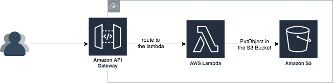

# Solution - Thomas Poignant
[](https://travis-ci.com/thomaspoignant/sre-hiring-test)  
Here is my solution to the SRE aircall test.


# Result
The code is deployed on my personal AWS account.

You can upload your image with this command:
```shell
curl -X POST https://o8eaa6dwbc.execute-api.eu-west-1.amazonaws.com/prod/image \
--form 'file=@filename.jpg' \
--form 's3Key=filename.jpg'
```

It will be available on this S3 bucket : `https://tpoi-aircall-bucket-prod.s3.eu-west-1.amazonaws.com/`.  
In our example it will be available at [https://tpoi-aircall-bucket-prod.s3.eu-west-1.amazonaws.com/filename.jpg](https://tpoi-aircall-bucket-prod.s3.eu-west-1.amazonaws.com/filename.jpg).

# Documentation

## Architecture
We have a simple serverless architecture, with an api gateway, a lambda and they upload it to S3.


## Project information
### Prerequisite
Before deploying the project you should have `docker` and set up your AWS credentials.

### Infra as code
The infrastructure as code of this app is build with the [`serverless` framework](https://www.serverless.com/).
The configuration is available in the [serverless.yml](serverless.yml) file.

### Build the app
If you want to deploy your lambda to the dev environment, you can still use:
```shell
npm run deploy
```
The difference is that we use docker to build and deploy the lambda.

# CI/CD
The CI/CD is managed by travis, and this action are automaticaly done:

- For each commits we build the solution and we run the tests.
- For each commits on `master` branch we are deploying the `dev` environment.
- For each tags named `vX.X.X` we are deploying the `prod` environment.

# Logs
All the logs of the lambda are available in cloudwatch.

# Tracing
Xray is activate on the API Gateway and the lambda.
You can also use the Xray SDK to add monitoring inside your lambda.